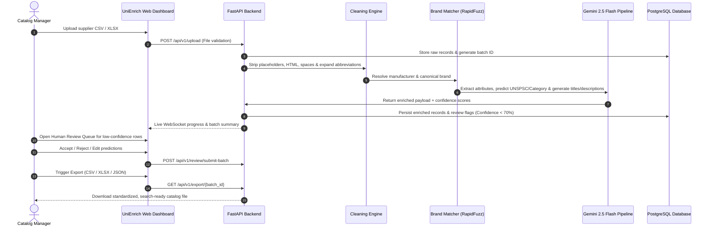

# Product Requirements Document (PRD)
## UniEnrich AI – Intelligent Product Data Enrichment Platform

---

## 1. Document Control & Metadata

| Field | Value |
| :--- | :--- |
| **Product Name** | **UniEnrich AI** |
| **Tagline** | *"Transform messy industrial product catalogs into structured, searchable, AI-enriched product data."* |
| **Document Version** | 1.0.0 (Production / Hackathon Baseline) |
| **Status** | Approved & Ready for Implementation |
| **Owner / Lead Architect** | Antigravity AI Engineering Team |
| **Target Delivery** | Hackathon MVP & Enterprise Catalog Solution |
| **Domain** | Industrial Supply Chain, MRO (Maintenance, Repair & Operations), E-Commerce Catalog Management |

---

## 2. Executive Summary

Industrial distributors, wholesalers, and B2B marketplace operators face an ongoing operational bottleneck: raw product data delivered by hundreds of independent manufacturers is notoriously messy, unstructured, abbreviated, and inconsistent.

Typical manufacturer feeds contain truncated short descriptions (e.g., `"3/4 CPLG BRS 150#"`), missing critical attributes, unstandardized brand names (`"3 M"`, `"3M INC"` instead of `"3M™"`), lack of standardized category classification (UNSPSC/eCl@ss), and zero customer-facing descriptive copy.

**UniEnrich AI** is an enterprise-grade, end-to-end intelligent catalog data enrichment platform. It seamlessly ingests raw CSV/XLSX product feeds, applies deterministic cleaning and fuzzy entity resolution, leverages LLM-driven structured attribute extraction (Gemini 2.5 Flash), predicts standard taxonomy classifications, automatically generates multi-tier marketing and mobile descriptions, computes granular confidence scores, and routes low-confidence fields to an interactive Human-in-the-Loop (HITL) review dashboard before producing standardized, search-ready exports.

---

## 3. Problem Statement & Market Opportunity

```
┌────────────────────────────────────────────────────────┐
│               RAW INDUSTRIAL CATALOG DATA              │
│  "3/4 CPLG BRS 150#" | Brand: "3 M" | Category: None   │
└───────────────────────────┬────────────────────────────┘
                            │ (Current State: Manual Excel edits)
                            ▼
              ┌───────────────────────────┐
              │  PAIN POINTS & BOTTLENECKS │
              ├───────────────────────────┤
              │ • 15+ hrs/week per catalog│
              │ • 40%+ search miss rate   │
              │ • High SKU return rates   │
              │ • Inconsistent units/specs│
              └─────────────┬─────────────┘
                            │ (Solution: UniEnrich AI Engine)
                            ▼
┌────────────────────────────────────────────────────────┐
│           STANDARDIZED SEARCH-READY CATALOG            │
│  Title: "3M™ 3/4 in Brass Pipe Coupling, 150 PSI"       │
│  Brand: "3M™" | Cat: Plumbing > Fittings > Couplings    │
│  Attributes: {Type: Coupling, Size: 3/4 in, ...}       │
│  Descriptions: Short, Mobile, E-commerce Long           │
└────────────────────────────────────────────────────────┘
```

### 3.1 Pain Points Addressed
1. **Cryptic & Abbreviated Descriptions**: Industry catalogs use shorthand such as `BRS` (Brass), `CPLG` (Coupling), `SS` (Stainless Steel), `NPT` (National Pipe Taper), resulting in poor on-site search recall.
2. **Missing & Unstructured Attributes**: Critical technical specifications (Material, Voltage, Thread Size, Operating Temperature, Pressure Rating) are buried inside unformatted text strings rather than structured key-value pairs.
3. **Brand & Manufacturer Inconsistency**: Duplicate entity representations prevent proper brand filtering and facet navigation.
4. **Placeholder Values Treated as Valid Data**: Strings like `"-- Unbranded --"`, `"N/A"`, `"UNKNOWN"`, `"."`, and `"000000"` pollute database records.
5. **Lack of Multi-Channel Content**: Products lack SEO titles, mobile-optimized bullet summaries, and professional e-commerce product copy.
6. **No Quality Visibility**: Traditional import scripts do not calculate field-level confidence scores, risking widespread data corruption without human oversight.

---

## 4. Product Vision & Goals

### 4.1 Vision Statement
To become the definitive, high-accuracy intelligence layer for industrial supply chains that transforms raw supplier data into catalog-ready, search-optimized assets in minutes rather than weeks.

### 4.2 Core Objectives & OKRs
- **Objective 1**: Reduce catalog onboarding time by **>85%** compared to manual spreadsheet normalization.
- **Objective 2**: Achieve **>95% accuracy** in brand canonicalization and abbreviation expansion.
- **Objective 3**: Deliver **100% structured attribute extraction** across 15+ core industrial parameters with field-level confidence scores.
- **Objective 4**: Ensure seamless human-in-the-loop review routing whenever aggregate confidence drops below **70%**.
- **Objective 5**: Guarantee 100% schema fidelity in exported CSV, Excel, and JSON files.

---

## 5. User Personas & User Journeys

### 5.1 User Personas

| Persona | Role | Primary Goal | Pain Points |
| :--- | :--- | :--- | :--- |
| **Marcus Vance** | Catalog Operations Manager | Rapidly ingest supplier feeds and maintain catalog consistency across 50,000+ SKUs. | Spends 60% of work week reviewing broken spreadsheets; lacks automated enrichment tooling. |
| **Elena Rostova** | E-Commerce Merchandiser | Ensure product listings have rich SEO descriptions, clear specifications, and high facet discoverability. | Sparse product pages with empty attribute filters leading to customer bounce and search abandonment. |
| **David Chen** | Data QA Specialist / Reviewer | Inspect flagged discrepancies, review low-confidence AI predictions, and validate mass edits before catalog sync. | No unified split-screen review interface; manually reconciling before-and-after rows is tedious. |
| **Sarah Jenkins** | B2B Procurement Officer | Search catalog by exact technical specs (e.g., `"Brass 150 PSI 3/4 Coupling"`). | Search fails to return relevant items due to unexpanded abbreviations in supplier files. |

### 5.2 End-to-End User Journey



---

## 6. Detailed System Architecture & Workflow

```
                        ┌───────────────────────────────┐
                        │      RAW FILE INGESTION       │
                        │    CSV / XLSX (Drag & Drop)   │
                        └───────────────┬───────────────┘
                                        │
                                        ▼
                        ┌───────────────────────────────┐
                        │    DATA VALIDATION LAYER      │
                        │ Schema Check • Error Trap     │
                        │ Duplicate SKU Quarantine      │
                        └───────────────┬───────────────┘
                                        │
                                        ▼
                        ┌───────────────────────────────┐
                        │     DATA CLEANING ENGINE      │
                        │ Whitespace • HTML Strip       │
                        │ Placeholder to NULL Neutralize│
                        │ Abbreviation Expansion        │
                        └───────────────┬───────────────┘
                                        │
                                        ▼
                        ┌───────────────────────────────┐
                        │  BRAND & MANUFACTURER RESOLVER│
                        │ RapidFuzz Matching • Lookup   │
                        │ Canonical Normalization       │
                        └───────────────┬───────────────┘
                                        │
                                        ▼
                        ┌───────────────────────────────┐
                        │     AI ATTRIBUTE EXTRACTION   │
                        │ Gemini 2.5 Flash Structured   │
                        │ Material, Size, Pressure, etc.│
                        └───────────────┬───────────────┘
                                        │
                                        ▼
                        ┌───────────────────────────────┐
                        │   PRODUCT CLASSIFICATION AI   │
                        │ Category • Subcategory        │
                        │ UNSPSC Code • Product Family  │
                        └───────────────┬───────────────┘
                                        │
                                        ▼
                        ┌───────────────────────────────┐
                        │    AI DESCRIPTION GENERATOR   │
                        │ SEO Title • Mobile Summary    │
                        │ E-Commerce Long Description   │
                        └───────────────┬───────────────┘
                                        │
                                        ▼
                        ┌───────────────────────────────┐
                        │   CONFIDENCE SCORING ENGINE   │
                        │ Field Weights • Aggregate Calc│
                        └───────┬───────────────┬───────┘
                                │               │
                  Score >= 70%  │               │ Score < 70%
                                ▼               ▼
               ┌───────────────────┐    ┌─────────────────────┐
               │ AUTO-APPROVED POOL│    │ HUMAN REVIEW QUEUE  │
               └─────────┬─────────┘    │ Split-Screen Editor │
                         │              └──────────┬──────────┘
                         │                         │ Approved/Edited
                         └────────────┬────────────┘
                                      │
                                      ▼
                        ┌───────────────────────────────┐
                        │         EXPORT ENGINE         │
                        │ Standard CSV • Excel • JSON   │
                        └───────────────────────────────┘
```

---

## 7. Functional Module Specifications

### Module 1: File Ingestion & Validation
- **Accepted Formats**: `.csv`, `.xlsx`, `.xls`, `.tsv`.
- **Pre-flight Checks**:
  - Detect row count, encoding (`UTF-8`, `Latin-1`, `Windows-1252`), and delimiter (`,`, `;`, `\t`, `|`).
  - Quarantine malformed rows (unbalanced quotes, mismatched column counts).
  - Detect duplicate SKUs/Part Numbers within the file and flag for resolution.
  - Display immediate summary statistics: *Total Products Uploaded, Rows with Errors, Duplicate Rows, Missing Brand Rows*.

### Module 2: Data Cleaning & Pre-Processing Engine
- **Whitespace & Encoding Normalization**: Strip leading/trailing spaces, reduce multiple internal whitespaces, remove non-printable ASCII/control characters.
- **HTML & Special Tag Stripper**: Sanitize all incoming fields of embedded HTML tags (`<p>`, `<br>`, `<b>`, `&amp;`, `&quot;`).
- **Placeholder Neutralization**: Detect and convert dummy strings into true `NULL`:
  - Patterns: `"-- Unbranded --"`, `"N/A"`, `"None"`, `"NULL"`, `"0"`, `"UNKNOWN"`, `"."`, `"- -"`
- **Deterministic Industrial Abbreviation Expander**:
  - `CPLG` → `Coupling`
  - `BRS` → `Brass`
  - `SS` / `ST ST` → `Stainless Steel`
  - `150#` / `150 LB` → `150 PSI`
  - `NPT` → `National Pipe Taper`
  - `M/F` → `Male/Female`
  - `SCH 40` → `Schedule 40`
  - `VALV` → `Valve`
  - `FLG` → `Flange`
  - `GALV` → `Galvanized`

### Module 3: Brand & Manufacturer Normalization
- **Fuzzy Matching**: Powered by `RapidFuzz` (WRLatio, Token Sort Ratio) against a curated master database of industrial brands and parent manufacturers.
- **Canonical Lookup**:
  - Ingest variations: `"3 M"`, `"3M"`, `"3M INC"`, `"3M Corporation"` → Canonical output: `"3M™"`.
  - Ingest variations: `"DEWALT"`, `"De Walt"`, `"DEWALT INDUSTRIAL"` → Canonical output: `"DEWALT®"`.
  - Ingest variations: `"MILWAUKEE"`, `"Milwaukee Electric Tool"` → Canonical output: `"Milwaukee®"`.
- **Output Metrics**: Returns `resolved_brand_name`, `brand_id`, and `brand_match_confidence` (0.0 to 1.0).

### Module 4: AI Technical Attribute Extraction
- **Target Attributes**:
  - `Material` (e.g., Brass, Stainless Steel 316, Cast Iron, PVC)
  - `Size / Diameter` (e.g., 3/4 in, 2 in, 1/2 in)
  - `Pressure Rating` (e.g., 150 psi, 3000 psi, 10 bar)
  - `Connection / End Type` (e.g., Female NPT x Female NPT, Flanged, Socket Weld)
  - `Voltage` (e.g., 120V, 240V, 480V 3-Phase)
  - `Thread Type` (e.g., NPT, BSPT, Metric)
  - `Finish / Coating` (e.g., Zinc Plated, Black Oxide, Galvanized)
  - `Series / Model Line` (e.g., Professional Series, Series 100)
  - `Operating Temperature Range` (e.g., -20°F to 400°F)
  - `Mounting Type`, `Color`, `Weight`, `Length`
- **Output Format**: Strict Pydantic-validated JSON object with normalized standard units.

### Module 5: Automated Taxonomy & Classification
- Predicts 4-tier taxonomy structure:
  - `Category` (e.g., Plumbing & Hydraulics, Electrical, Tools & Hardware)
  - `Subcategory` (e.g., Pipe Fittings, Circuit Breakers, Power Drills)
  - `Product Family` (e.g., Couplings, Molded Case Breakers)
  - `UNSPSC Code` (8-digit standard UNSPSC commodity code, e.g., `40141700`)

### Module 6: Multi-Tier AI Description Generator
Generates three publication-ready content assets per SKU:
1. **Standard Product Title**: Follows standardized naming syntax: `[Brand] + [Series] + [Key Attribute/Size] + [Product Type] + [Part Number]` (e.g., `"3M™ 3/4 in Brass Pipe Coupling, 150 PSI"`).
2. **Mobile Description**: Concise 1–2 sentence summary highlighting primary function, key specifications, and top differentiator.
3. **E-Commerce Long Description**: One coherent, professionally drafted paragraph incorporating all extracted technical attributes, compliance standards, and industrial applications.

### Module 7: Granular Confidence Scoring & Quality Engine
- Computes individual field confidence scores $C_i \in [0, 100\%]$ for:
  - Brand Resolution ($W = 0.20$)
  - Category Classification ($W = 0.20$)
  - Core Technical Attributes ($W = 0.35$)
  - Title & Description Generation ($W = 0.25$)
- **Aggregate Confidence Formula**:
  $$C_{\text{aggregate}} = \sum (C_i \times W_i)$$
- **Routing Rules**:
  - If $C_{\text{aggregate}} \ge 70\%$: Flagged as `Auto-Approved`.
  - If $C_{\text{aggregate}} < 70\%$ or any critical field (Brand/Category) is `< 60%`: Flagged as `Needs Human Review`.

### Module 8: Human-in-the-Loop Review Dashboard
- **Split-Screen Before/After Comparator**: Visually maps raw supplier input directly against the AI-enriched output.
- **Changed Field Highlighting**: High-contrast visual pills identifying exact values added, modified, or normalized.
- **Inline Editing Grid**: Allows Catalog Reviewers to accept, reject, or manually overwrite any attribute directly in the table.
- **Bulk Action Capabilities**: "Accept All High-Confidence (>85%)", "Re-run with Alternate Prompt", "Batch Reject".

### Module 9: Analytics & Operational Insights
- Interactive charts rendering:
  - Brand distribution breakdowns.
  - Data completeness gains (Missing attributes before vs. after).
  - Confidence distribution histogram.
  - Category distribution sunburst / bar chart.
  - Human review throughput rate and audit log.

### Module 10: Multi-Format Exporter
- Exports enriched records matching standard e-commerce schemas (Shopify, BigCommerce, Magento, PIM systems, ERP formats).
- Supported output formats: `.csv`, `.xlsx`, `.json`.

---

## 8. Non-Functional Requirements (NFRs)

| Category | Requirement Specification |
| :--- | :--- |
| **Performance** | Ingest and parse 1,000 raw CSV rows in `< 1.5 seconds`. Batch enrichment processing via Gemini 2.5 Flash at `< 2.5 seconds` per batch (10 SKUs per batch with parallel execution). |
| **Scalability** | Asynchronous task execution using FastAPI background workers / Celery, capable of scaling to 50,000+ SKU catalogs. |
| **Reliability** | Fallback rule engine that activates if LLM endpoints encounter rate limits or timeouts, ensuring zero pipeline crashes. |
| **Security** | Role-Based Access Control (Admin, Reviewer, Viewer), strict CSV sanitization (prevention of CSV formula injection attacks like `=cmd|`), SSL/TLS in transit. |
| **Data Integrity** | Full immutability of raw input data: original records are preserved side-by-side with enriched versions for complete auditability. |
| **UI Responsiveness** | Next.js frontend with sub-100ms client interactions, zero AI slop gradients, utilizing the custom approved 13-palette design system. |

---

## 9. Design System & Curated Color Palette Tokens

To guarantee clean, sharp, enterprise-grade typography and eliminate sloppy AI dark gradients, the platform strictly enforces the following color tokens:

```
┌──────────────────────────────────────────────────────────────────────────┐
│                   UNIENRICH AI APPROVED COLOR PALETTE                    │
├─────────────────┬────────────────────────────────────────────────────────┤
│ Black (Base/UI) │ #161616 (Canvas), #232323 (Card), #2c2c2c, #363636     │
│ White (Light/BG)│ #f6f6f6, #f5f4f2, #faf9f7, #f2f1ef                     │
│ Red (Errors)    │ #a52020, #8e0300, #76150c, #5a0e07                     │
│ Blue (Primary)  │ #347aea, #1c47c6, #1e4ba3, #041162                     │
│ Green (Approved)│ #beddb0, #7aa95d, #395b39, #273f27                     │
│ Purple (AI Ops) │ #b084f7, #8347ed, #6b31d9, #582dca                     │
│ Orange (Warnings│ #ec8e39, #e37830, #cd5f29, #b13f21                     │
│ Pink (Badges)   │ #f6cae5, #f1abd6, #e978c2, #da3473                     │
│ Light Blue      │ #cedaee, #b5cee5, #9eb8d2, #6d8cbe                     │
│ Lime (Tokens)   │ #c3cda0, #b2c176, #89994c, #5c642a                     │
│ Brown (Neutral) │ #c4af93, #83664b, #5c4134, #301e14                     │
│ Grey (Borders)  │ #d4d5d9, #b3b5ba, #94969b, #6b6e71                     │
│ Yellow (Review) │ #f5e06d, #f0cf47, #eabe41, #e5b23e                     │
└─────────────────┴────────────────────────────────────────────────────────┘
```

---

## 10. User Stories & Acceptance Criteria

### US-01: CSV File Upload & Parsing
- **As a** Catalog Manager
- **I want to** drag and drop a supplier CSV file containing thousands of messy rows
- **So that** the platform validates the schema, identifies syntax errors, and isolates duplicates immediately.
- **Acceptance Criteria**:
  - Given a valid CSV or XLSX file up to 25MB, upload finishes within 2 seconds.
  - Error cards display accurate counts for: Total SKUs, Syntax Errors, Duplicate SKUs, Missing Brands.
  - Invalid rows are quarantined into an exportable error ledger without halting the entire job.

### US-02: Deterministic Cleaning & Brand Canonicalization
- **As a** Data Specialist
- **I want** messy strings (e.g., `"-- Unbranded --"`, `3/4 CPLG BRS 150#`, `"3 M"`) cleaned and normalized
- **So that** all known industry abbreviations and brand variations are resolved before AI extraction.
- **Acceptance Criteria**:
  - `"-- Unbranded --"` becomes `NULL`.
  - `"3 M"` is mapped to `"3M™"` with a fuzzy match score $\ge 90\%$.
  - Abbreviations (`CPLG`, `BRS`, `150#`) are expanded to full technical terms (`Coupling`, `Brass`, `150 PSI`).

### US-03: AI Technical Attribute Extraction
- **As an** E-Commerce Merchandiser
- **I want** the system to extract structured technical attributes into key-value JSON
- **So that** customers can filter products by Material, Size, Voltage, and Pressure on our storefront.
- **Acceptance Criteria**:
  - Generates validated JSON containing all detected attributes with confidence scores.
  - Values adhere to standardized unit conventions (e.g., `psi`, `in`, `V`, `°F`).

### US-04: Human Review of Low-Confidence Records
- **As a** Data Reviewer
- **I want to** see a dedicated review queue of all records with confidence $< 70\%$
- **So that** I can review side-by-side differences, accept AI predictions, or edit values before final export.
- **Acceptance Criteria**:
  - Split-screen table highlighting raw input vs. AI predictions.
  - Reviewer can click "Accept", "Reject", or double-click to edit cell values inline.
  - Edited records automatically update confidence to 100% (Manual Verification flag).

---

## 11. Risk Analysis & Mitigation Matrix

| Risk | Severity | Likelihood | Mitigation Strategy |
| :--- | :--- | :--- | :--- |
| **LLM Rate Limits / API Downtime** | High | Medium | Implement batching (10 SKUs/prompt), exponential backoff, and a deterministic regex/lookup rule engine fallback. |
| **Hallucinated Attributes** | High | Low | Enforce strict Pydantic schema validation, temperature = 0.1, and cross-reference extracted terms against input tokens. |
| **Large File Browser Lag** | Medium | Medium | Implement virtualized tables (AG Grid / TanStack Virtual) and paginated server-side queries. |
| **CSV Formula Injection** | Medium | Low | Sanitize all exported cells starting with `=`, `+`, `-`, or `@` by prepending a single quote (`'`). |

---

## 12. Milestones & Release Roadmap

```
┌─────────────────────────┐     ┌─────────────────────────┐     ┌─────────────────────────┐
│       MILESTONE 1       │     │       MILESTONE 2       │     │       MILESTONE 3       │
│  Foundation & Planning  │ ──► │   Core Data Pipeline    │ ──► │  AI & Attribute Engine  │
│  • PRD, SRS, Tech Stack │     │  • CSV Parser & Cleaner │     │  • Gemini 2.5 Flash     │
│  • Design Tokens & Setup│     │  • RapidFuzz Resolver   │     │  • Classifier & Naming  │
└─────────────────────────┘     └─────────────────────────┘     └─────────────────────────┘
                                                                             │
                                                                             ▼
┌─────────────────────────┐     ┌─────────────────────────┐     ┌─────────────────────────┐
│       MILESTONE 5       │     │       MILESTONE 4       │     │       MILESTONE 4B      │
│  Production & Showcase  │ ◄── │  Analytics & Exporter   │ ◄── │  Human Review Dashboard │
│  • Live URL & Docker    │     │  • CSV/XLSX Exporter    │     │  • Split-Screen UI      │
│  • Demo Video & Slides  │     │  • Recharts Analytics   │     │  • Inline AG Grid Edit  │
└─────────────────────────┘     └─────────────────────────┘     └─────────────────────────┘
```
