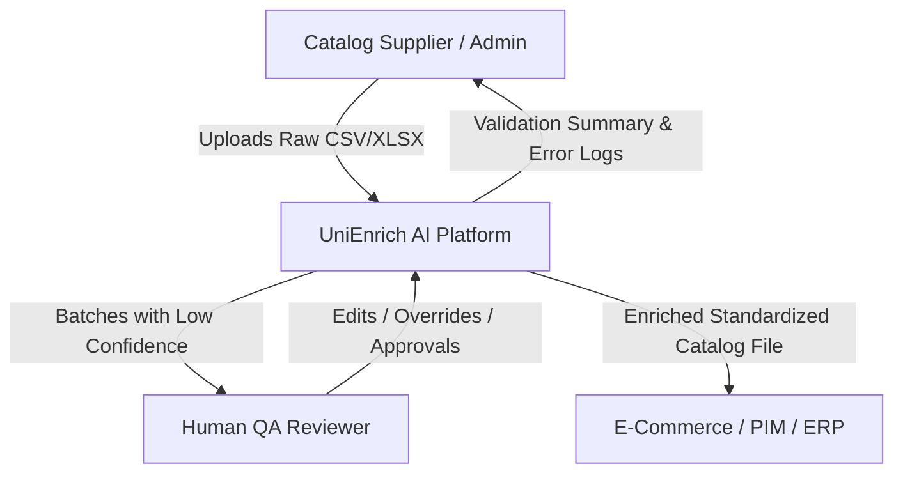
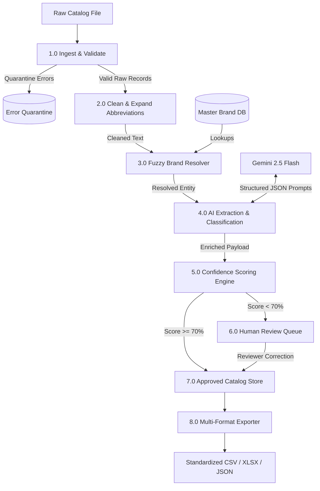
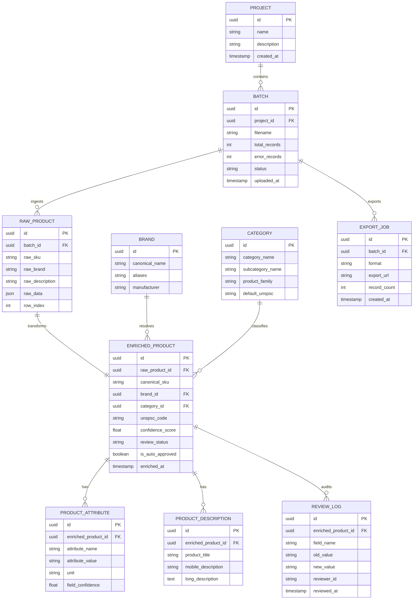

# Software Requirements Specification (SRS)
## Standard: IEEE 29148 / IEEE 830 Compliant
### Project: UniEnrich AI – Intelligent Product Data Enrichment Platform

---

## Document Control

| Revision | Date | Author / Architect | Description |
| :--- | :--- | :--- | :--- |
| **1.0.0** | 2026-08-21 | Antigravity AI Engineering Team | Initial Comprehensive IEEE 29148 Baseline |

---

## Table of Contents
1. **Introduction**
   - 1.1 Purpose
   - 1.2 Scope
   - 1.3 Definitions, Acronyms, and Abbreviations
   - 1.4 References
   - 1.5 Document Overview
2. **Overall Description**
   - 2.1 Product Perspective
   - 2.2 System Context & Data Flow Diagrams (DFD Level 0 & Level 1)
   - 2.3 Product Functions
   - 2.4 User Classes and Characteristics
   - 2.5 Operating Environment
   - 2.6 Design and Implementation Constraints
   - 2.7 Assumptions and Dependencies
3. **External Interface Requirements**
   - 3.1 User Interfaces (UI Design System & Component Guidelines)
   - 3.2 Hardware Interfaces
   - 3.3 Software Interfaces (FastAPI, PostgreSQL, Gemini 2.5 Flash API)
   - 3.4 Communications Interfaces (REST / WebSocket / SSE)
4. **System Features & Functional Requirements**
   - 4.1 System Feature 1: Multi-Format File Ingestion & Parsing (FR-01 to FR-05)
   - 4.2 System Feature 2: Deterministic Data Cleaning & Normalization (FR-06 to FR-10)
   - 4.3 System Feature 3: Brand & Manufacturer Entity Resolution (FR-11 to FR-15)
   - 4.4 System Feature 4: AI Technical Attribute Extraction (FR-16 to FR-20)
   - 4.5 System Feature 5: Automated Taxonomy & Classification (FR-21 to FR-25)
   - 4.6 System Feature 6: AI Content & Description Generator (FR-26 to FR-30)
   - 4.7 System Feature 7: Confidence Scoring & HITL Routing (FR-31 to FR-35)
   - 4.8 System Feature 8: Human-in-the-Loop Review Dashboard (FR-36 to FR-40)
   - 4.9 System Feature 9: Analytics, Audit Trail & Multi-Format Exporter (FR-41 to FR-45)
5. **Non-Functional & Quality Requirements**
   - 5.1 Performance & Latency Requirements
   - 5.2 Reliability & Fault Tolerance
   - 5.3 Availability & Disaster Recovery
   - 5.4 Security & Compliance (RBAC, CSV Injection Protection)
   - 5.5 Maintainability & Extensibility
6. **Data & Storage Requirements**
   - 6.1 Logical Data Model & Entity Relationships
   - 6.2 Data Retention & Immutability
7. **Verification & Traceability Matrix**
8. **Appendices**
   - Appendix A: Standard Industrial Abbreviation Dictionary
   - Appendix B: Master Brand Normalization Canonical Table
   - Appendix C: System Error Codes

---

## 1. Introduction

### 1.1 Purpose
The purpose of this Software Requirements Specification (SRS) is to provide a complete, formal, and unambiguous specification of the functional, non-functional, interface, and behavioral requirements for **UniEnrich AI**. This document is intended for software developers, QA engineers, solutions architects, project reviewers, and hackathon evaluation panels.

### 1.2 Scope
**UniEnrich AI** is a specialized enterprise data engineering and artificial intelligence platform designed to convert inconsistent, abbreviated, unstandardized industrial catalog data feeds into high-fidelity, structured, search-optimized product records.

The software encompasses:
- File ingestion engine supporting CSV, TSV, and Excel spreadsheets.
- Deterministic data sanitation and abbreviation expansion.
- Fuzzy entity resolution for brand and manufacturer canonicalization.
- Multi-field LLM extraction powered by Google Gemini 2.5 Flash.
- Taxonomy classification (UNSPSC, Category, Subcategory).
- Tri-tier descriptive content synthesis (SEO Title, Mobile Summary, E-Commerce Description).
- Weighted field-level and aggregate confidence scoring.
- High-performance Human-in-the-Loop (HITL) review workspace.
- Export pipelines compatible with enterprise PIM/ERP/Storefront standards.

### 1.3 Definitions, Acronyms, and Abbreviations

| Term | Definition |
| :--- | :--- |
| **API** | Application Programming Interface |
| **CSV** | Comma-Separated Values |
| **DFD** | Data Flow Diagram |
| **ERP** | Enterprise Resource Planning |
| **HITL** | Human-in-the-Loop (Interactive human review workflow) |
| **LLM** | Large Language Model (specifically Google Gemini 2.5 Flash) |
| **MRO** | Maintenance, Repair, and Operations |
| **NPT** | National Pipe Taper thread standard |
| **PIM** | Product Information Management system |
| **PSI** | Pounds per Square Inch (pressure unit) |
| **RapidFuzz** | High-performance C++ based string matching library in Python |
| **RBAC** | Role-Based Access Control |
| **REST** | Representational State Transfer |
| **SKU** | Stock Keeping Unit |
| **UNSPSC** | United Nations Standard Products and Services Code |
| **UUID** | Universally Unique Identifier |

### 1.4 References
1. IEEE Std 29148-2018: *Systems and software engineering — Life cycle processes — Requirements engineering*.
2. IEEE Std 830-1998: *Recommended Practice for Software Requirements Specifications*.
3. UniHack Industrial Product Catalog Enrichment Guidelines (2026).
4. Google Gemini API Documentation: Structured Outputs & JSON Mode Specifications.

---

## 2. Overall Description

### 2.1 Product Perspective
UniEnrich AI acts as an autonomous data transformation middleware positioned between raw vendor catalog ingestion sources (FTP, manual uploads, supplier APIs) and downstream consumer platforms (E-Commerce Storefronts, PIMs, Search Indexes like Elasticsearch/Algolia, and ERPs).

```
 ┌──────────────────────┐
 │ Raw Supplier Feeds   │ (CSV / Excel / Incomplete Catalog Dumps)
 └──────────┬───────────┘
            │
            ▼
 ┌────────────────────────────────────────────────────────┐
 │                   UNIENRICH AI PLATFORM                │
 │  ┌──────────────────────────────────────────────────┐  │
 │  │ Ingestion & Validation Layer                     │  │
 │  ├──────────────────────────────────────────────────┤  │
 │  │ Deterministic Cleaning & Abbreviation Expander   │  │
 │  ├──────────────────────────────────────────────────┤  │
 │  │ RapidFuzz Brand Resolver                         │  │
 │  ├──────────────────────────────────────────────────┤  │
 │  │ Gemini 2.5 Flash Extraction & Taxonomy Engine    │  │
 │  ├──────────────────────────────────────────────────┤  │
 │  │ Confidence Scoring & Human Review Queue          │  │
 │  └──────────────────────────────────────────────────┘  │
 └──────────┬─────────────────────────────────────────────┘
            │
            ▼
 ┌──────────────────────┐
 │ Clean Catalog Export │ (Standardized CSV, PIM Sync, Search Indexes)
 └──────────────────────┘
```

### 2.2 System Context & Data Flow Diagrams

#### DFD Level 0 (Context Diagram)


#### DFD Level 1 (Decomposed Data Flow)


### 2.3 Product Functions
1. **Multi-file Ingestion**: Stream-parsing of large tabular datasets with automatic delimiter detection and header reconciliation.
2. **Deterministic Data Normalization**: Regex-driven sanitization of HTML, trailing whitespace, non-printable characters, placeholder neutralization, and unit expansion.
3. **Brand Canonicalization**: Fuzzy matching across historical brand registries using weighted Levenshtein and Token Sort algorithms.
4. **Attribute Dissection**: Zero-shot and few-shot extraction of 15+ engineering attributes formatted into strict typed JSON schemas.
5. **Hierarchical Taxonomy Mapping**: Automated mapping of industrial products to 4-tier categories and 8-digit UNSPSC codes.
6. **Multi-Channel Copy Generation**: Synthesis of standardized search titles, mobile short blurbs, and e-commerce product copy.
7. **Quality Assessment**: Metric computation establishing individual and aggregate confidence scores.
8. **Collaborative Review Portal**: Split-screen editing grid with visual difference tracking and bulk resolution actions.
9. **Data Exporting**: Structured output generation with sanitization against spreadsheet formula execution vulnerabilities.

### 2.4 User Classes and Characteristics

| User Class | Technical Expertise | System Rights | Primary Tasks |
| :--- | :--- | :--- | :--- |
| **Catalog Administrator** | Medium | Full System Access | Upload feeds, manage API keys, configure taxonomy rules, trigger global batch exports. |
| **Data QA Reviewer** | Basic–Medium | Review & Edit Rights | Inspect low-confidence records, edit extracted attributes, approve/reject changes. |
| **Procurement Merchandiser** | Basic | Read & Export Rights | View analytics, download completed catalogs, evaluate data coverage metrics. |

### 2.5 Operating Environment
- **Server OS**: Linux (Ubuntu 22.04 LTS), macOS, Windows 10/11 with Python 3.11+.
- **Client Browsers**: Google Chrome 120+, Mozilla Firefox 120+, Apple Safari 17+, Microsoft Edge 120+.
- **Database**: PostgreSQL 15+ / 16+.
- **Cloud/Container**: Docker, Docker Compose, AWS ECS / Render / Railway.

### 2.6 Design and Implementation Constraints
- **Design System Constraint**: User interface must strictly adhere to the approved 13-palette design tokens. No dark gradient visual slop is permitted.
- **LLM Rate Limiting**: The backend must handle Gemini 2.5 Flash API quotas via batching, throttling, and automated retry mechanisms.
- **Schema Strictness**: All AI-extracted attributes must conform to Pydantic validation schemas; unvalidated free-form JSON is rejected.
- **File Size**: Single file upload limit capped at 50MB (~100,000 SKUs) in browser memory.

### 2.7 Assumptions and Dependencies
- Catalog input files contain at least one descriptive field (`Description`, `Title`, `Part Description`, or `Item Name`).
- Gemini API key is configured with sufficient RPM/TPM quota.
- Master brand database contains primary industrial manufacturer names for fuzzy lookup seed.

---

## 3. External Interface Requirements

### 3.1 User Interfaces
The user interface is engineered in Next.js 15 (App Router) using Tailwind CSS v4 and strictly follows the approved 13-palette token scheme:

| Color Token Category | Approved Hex Values | UI Usage |
| :--- | :--- | :--- |
| **Black / Dark Neutrals** | `#161616`, `#232323`, `#2c2c2c`, `#363636` | Background canvas, sidebar, cards, high-contrast borders. |
| **White / Warm Light** | `#f6f6f6`, `#f5f4f2`, `#faf9f7`, `#f2f1ef` | Crisp light surfaces, typography, active card backgrounds. |
| **Red** | `#a52020`, `#8e0300`, `#76150c`, `#5a0e07` | Error flags, rejected records, deletion triggers. |
| **Blue** | `#347aea`, `#1c47c6`, `#1e4ba3`, `#041162` | Primary buttons, active navigation tabs, brand highlights. |
| **Green** | `#beddb0`, `#7aa95d`, `#395b39`, `#273f27` | High confidence badges (>85%), approved records, success alerts. |
| **Purple** | `#b084f7`, `#8347ed`, `#6b31d9`, `#582dca` | AI processing indicators, LLM generation state pills. |
| **Orange** | `#ec8e39`, `#e37830`, `#cd5f29`, `#b13f21` | Warning alerts, missing attribute tags. |
| **Pink** | `#f6cae5`, `#f1abd6`, `#e978c2`, `#da3473` | Special category tags, attribute badges. |
| **Light Blue** | `#cedaee`, `#b5cee5`, `#9eb8d2`, `#6d8cbe` | Secondary stat badges, table header backgrounds. |
| **Lime** | `#c3cda0`, `#b2c176`, `#89994c`, `#5c642a` | Technical dimension indicators, unit tags. |
| **Brown** | `#c4af93`, `#83664b`, `#5c4134`, `#301e14` | Raw/legacy data badges, unchanged field indicators. |
| **Grey** | `#d4d5d9`, `#b3b5ba`, `#94969b`, `#6b6e71` | Dividers, subtle borders, inactive button states. |
| **Yellow** | `#f5e06d`, `#f0cf47`, `#eabe41`, `#e5b23e` | Human Review Required badges (Confidence < 70%). |

### 3.2 Hardware Interfaces
- No direct custom hardware interfaces required. Standard HTTPS client-server hardware interactions.

### 3.3 Software Interfaces
- **FastAPI**: Backend REST API server communicating over port 8000.
- **PostgreSQL**: Relational database connected via SQLAlchemy asynchronous connection pools (`asyncpg`).
- **Google Gemini API**: REST/gRPC client utilizing Gemini 2.5 Flash with structured output schemas.
- **RapidFuzz C++ Engine**: In-memory brand resolver matching up to 100,000 strings/sec.

### 3.4 Communications Interfaces
- **HTTP/HTTPS**: Standard RESTful operations for file upload, configuration, and data export.
- **WebSocket / Server-Sent Events (SSE)**: Real-time progress updates during AI enrichment (`/api/v1/enrich/progress/{batch_id}`).

---

## 4. System Features & Functional Requirements

### 4.1 System Feature 1: Multi-Format File Ingestion & Parsing

| Requirement ID | Description | Priority |
| :--- | :--- | :--- |
| **FR-01** | The system shall accept tabular files in `.csv`, `.xlsx`, `.xls`, and `.tsv` formats up to 50MB. | High |
| **FR-02** | The system shall automatically detect file encoding (`UTF-8`, `Latin-1`, `Windows-1252`) and delimiter (`,`, `;`, `\t`, `\|`). | High |
| **FR-03** | The system shall perform pre-flight validation to detect header rows, unclosed quotes, and mismatched column counts. | High |
| **FR-04** | The system shall identify duplicate SKUs/Part Numbers within the uploaded file and prompt user for merge or overwrite strategy. | Medium |
| **FR-05** | The system shall render an immediate upload scorecard displaying: *Total Products Uploaded, Rows with Errors, Duplicate Rows, Missing Brand Rows*. | High |

### 4.2 System Feature 2: Deterministic Data Cleaning & Normalization

| Requirement ID | Description | Priority |
| :--- | :--- | :--- |
| **FR-06** | The system shall remove leading, trailing, and redundant consecutive whitespace characters across all text fields. | High |
| **FR-07** | The system shall sanitize all embedded HTML tags (`<p>`, `<br>`, `<b>`, `<span>`, `&amp;`, `&quot;`) from descriptions. | High |
| **FR-08** | The system shall identify placeholder strings (e.g., `"-- Unbranded --"`, `"N/A"`, `"UNKNOWN"`, `"."`, `"000000"`) and convert them into true SQL `NULL` values. | High |
| **FR-09** | The system shall expand standard industrial abbreviations (e.g., `CPLG` → `Coupling`, `BRS` → `Brass`, `SS` → `Stainless Steel`, `150#` → `150 PSI`) using a deterministic lookup engine. | High |
| **FR-10** | The system shall normalize casing for model codes, part numbers, and standard units while preserving capitalization in registered trademarks. | Medium |

### 4.3 System Feature 3: Brand & Manufacturer Entity Resolution

| Requirement ID | Description | Priority |
| :--- | :--- | :--- |
| **FR-11** | The system shall maintain an extensible master brand registry containing canonical brand names, aliases, and parent manufacturer mappings. | High |
| **FR-12** | The system shall execute fuzzy matching using RapidFuzz (WRLatio and Token Sort Ratio) with a configurable match threshold (default: 85%). | High |
| **FR-13** | The system shall map brand variations (e.g., `"3 M"`, `"3M"`, `"3M INC"`, `"3M Corporation"`) to their canonical representation (`"3M™"`). | High |
| **FR-14** | If a brand name is missing in the raw row, the system shall attempt to extract brand mentions from the product description string. | High |
| **FR-15** | The system shall attach a `brand_confidence_score` (0.0 to 1.0) and flag unmatched brands for human review. | High |

### 4.4 System Feature 4: AI Technical Attribute Extraction

| Requirement ID | Description | Priority |
| :--- | :--- | :--- |
| **FR-16** | The system shall pass cleaned product strings to Gemini 2.5 Flash with a structured Pydantic schema for technical attribute extraction. | High |
| **FR-17** | The system shall extract standard industrial attributes: `Material`, `Size / Diameter`, `Pressure Rating`, `Voltage`, `Thread Type`, `Connection Type`, `Length`, `Finish`, `Series`, `Operating Temperature`, `Mounting`, `Weight`, and `Color`. | High |
| **FR-18** | The system shall standardize all physical measurement units (e.g., converting `150 LB` or `150#` to `150 psi`, `3/4"` to `3/4 in`, `120 Volts` to `120V`). | High |
| **FR-19** | The system shall assign an individual confidence score to each extracted attribute field based on token grounding and extraction certainty. | High |
| **FR-20** | The system shall execute a deterministic regex fallback extractor if LLM API rate limits or network failures occur. | High |

### 4.5 System Feature 5: Automated Taxonomy & Classification

| Requirement ID | Description | Priority |
| :--- | :--- | :--- |
| **FR-21** | The system shall predict the primary `Category` and `Subcategory` for each product record based on extracted attributes and product type. | High |
| **FR-22** | The system shall assign the corresponding 8-digit `UNSPSC Code` (e.g., `40141700` for Pipe Couplings). | High |
| **FR-23** | The system shall map products to standard `Product Family` hierarchies. | Medium |
| **FR-24** | The system shall generate a taxonomy classification confidence score. | High |
| **FR-25** | The system shall allow administrators to import custom category taxonomy trees via JSON or CSV. | Medium |

### 4.6 System Feature 6: AI Content & Description Generator

| Requirement ID | Description | Priority |
| :--- | :--- | :--- |
| **FR-26** | The system shall generate a standardized, SEO-optimized **Product Title** following the syntax: `[Brand] + [Series] + [Key Attribute/Size] + [Product Type] + [Part Number]`. | High |
| **FR-27** | The system shall generate a **Mobile Description** (concise 1–2 sentence summary optimized for mobile viewport rendering). | High |
| **FR-28** | The system shall generate an **E-Commerce Long Description** consisting of a comprehensive paragraph embedding all extracted technical specifications. | High |
| **FR-29** | The system shall enforce character limit constraints (Title: 80–120 chars; Mobile: 120–160 chars; Long: 300–600 chars). | Medium |
| **FR-30** | The system shall prevent promotional hallucination and ensure 100% factual grounding against input attributes. | High |

### 4.7 System Feature 7: Confidence Scoring & HITL Routing

| Requirement ID | Description | Priority |
| :--- | :--- | :--- |
| **FR-31** | The system shall compute a weighted aggregate confidence score for each product record: $C_{\text{agg}} = 0.20(C_{\text{brand}}) + 0.20(C_{\text{cat}}) + 0.35(C_{\text{attr}}) + 0.25(C_{\text{desc}})$. | High |
| **FR-32** | The system shall automatically route records with $C_{\text{agg}} < 70\%$ to the Human Review Queue. | High |
| **FR-33** | The system shall route records where either `Brand` or `Category` confidence $< 60\%$ to Human Review, regardless of aggregate score. | High |
| **FR-34** | The system shall automatically approve records with $C_{\text{agg}} \ge 70\%$ into the export-ready pool. | High |
| **FR-35** | The system shall persist full scoring breakdown metadata for auditability. | High |

### 4.8 System Feature 8: Human-in-the-Loop Review Dashboard

| Requirement ID | Description | Priority |
| :--- | :--- | :--- |
| **FR-36** | The UI shall provide an interactive split-screen view comparing raw supplier input against AI-enriched output. | High |
| **FR-37** | The UI shall highlight all modified, added, and normalized fields using high-contrast color badges. | High |
| **FR-38** | The UI shall provide an editable grid allowing reviewers to accept, reject, or inline-edit any field value. | High |
| **FR-39** | The system shall set confidence to 100% (`Manual Review Verified`) for all reviewer-modified or explicitly accepted records. | High |
| **FR-40** | The UI shall support bulk actions ("Accept All Filtered", "Batch Re-run AI", "Batch Reject"). | Medium |

### 4.9 System Feature 9: Analytics & Multi-Format Exporter

| Requirement ID | Description | Priority |
| :--- | :--- | :--- |
| **FR-41** | The system shall render real-time charts for brand distribution, data completeness delta, confidence histogram, and category breakdown. | High |
| **FR-42** | The system shall export clean, standardized catalog files in `.csv`, `.xlsx`, and `.json` formats. | High |
| **FR-43** | The system shall sanitize all export cells to prevent spreadsheet formula injection attacks (e.g., strings starting with `=`, `@`, `+`, `-`). | High |
| **FR-44** | The system shall allow users to select specific export profiles (Standard UniHack, Shopify, Magento, BigCommerce, Generic PIM). | Medium |
| **FR-45** | The system shall maintain an immutable export audit log detailing export timestamp, user, record count, and schema configuration. | High |

---

## 5. Non-Functional & Quality Requirements

### 5.1 Performance & Latency Requirements
- **File Parsing Throughput**: Ingestion and syntax parsing of a 1,000-row CSV file shall execute in $\le 1.5$ seconds.
- **AI Batch Latency**: Gemini 2.5 Flash batch processing shall maintain an average throughput of $\le 250\text{ ms}$ per SKU when processing in concurrent micro-batches of 10 SKUs.
- **UI Render Latency**: Virtualized data grid shall render 5,000 records with sub-100ms scrolling response time.

### 5.2 Reliability & Fault Tolerance
- **Zero Ingestion Crashes**: Malformed rows or unhandled characters shall be quarantined into an error store without aborting batch execution.
- **LLM Degradation Mode**: If Gemini API returns 429 (Rate Limit) or 5xx errors, the system shall initiate exponential backoff (up to 3 retries) before falling back to rule-based regex extraction.

### 5.3 Availability & Disaster Recovery
- System API and background processors shall maintain 99.9% uptime.
- Database transactions shall adhere strictly to ACID properties using PostgreSQL WAL (Write-Ahead Logging).

### 5.4 Security & Compliance
- **Authentication**: JWT-based bearer token authentication with bcrypt password hashing for multi-user support.
- **RBAC**: Three distinct access tiers: `Admin` (full system), `Reviewer` (review and edit queue), and `Viewer` (read-only and export).
- **Data Protection**: Encryption in transit via TLS 1.3 and encryption at rest for database volumes.
- **CSV Injection Prevention**: Automatic prefixing of special characters (`=`, `+`, `-`, `@`) in export streams.

---

## 6. Data & Storage Requirements

### 6.1 Logical Data Model



---

## 7. Verification & Traceability Matrix

| Requirement ID | Module | Verification Method | Pass Criteria |
| :--- | :--- | :--- | :--- |
| **FR-01 – FR-05** | Ingestion & Parser | Automated Integration Test | 1,000-row file ingested in $< 1.5\text{s}$; errors accurately quarantined. |
| **FR-06 – FR-10** | Cleaning Engine | Unit Test Suite (`pytest`) | 100% of HTML tags stripped; `"-- Unbranded --"` converted to `NULL`; `CPLG` → `Coupling`. |
| **FR-11 – FR-15** | Brand Resolver | Fuzzy Accuracy Benchmark | $\ge 95\%$ canonical match accuracy on 500 test brand aliases. |
| **FR-16 – FR-20** | Attribute Extraction | Schema Validation Test | 100% output complies with Pydantic schema; extracted units standardized. |
| **FR-21 – FR-25** | Classification | Taxonomy Evaluation | Product category and 8-digit UNSPSC code correctly predicted. |
| **FR-26 – FR-30** | Description Gen | Length & Quality Assertions | Title syntax matches `[Brand] + [Specs] + [Type]`; no promotional hallucinations. |
| **FR-31 – FR-35** | Confidence Engine | Mathematical Verification | Aggregate score correctly matches weighted sum; $< 70\%$ routed to review. |
| **FR-36 – FR-40** | Review Dashboard | End-to-End Cypress / Playwright | Reviewer edits persist to database and update confidence to 100%. |
| **FR-41 – FR-45** | Exporter & Security | CSV Injection Test | Exported cells with formulas properly escaped; file matches download schema. |

---

## 8. Appendices

### Appendix A: Standard Industrial Abbreviation Dictionary (Sample)

| Raw Abbreviation | Expanded Canonical Term | Category Domain |
| :--- | :--- | :--- |
| `CPLG` | Coupling | Pipe & Tube Fittings |
| `BRS` | Brass | Material |
| `SS` / `ST ST` / `S/S` | Stainless Steel | Material |
| `150#` / `150 LB` | 150 PSI | Pressure Rating |
| `3000#` | 3000 PSI | Pressure Rating |
| `NPT` | National Pipe Taper | Thread Type |
| `BSPT` | British Standard Pipe Taper | Thread Type |
| `FPT` / `FNPT` | Female National Pipe Taper | Connection Type |
| `MPT` / `MNPT` | Male National Pipe Taper | Connection Type |
| `SCH 40` / `SCH 80` | Schedule 40 / Schedule 80 | Pipe Wall Thickness |
| `VALV` / `VLV` | Valve | Valves & Controls |
| `FLG` | Flange | Fittings & Flanges |
| `GALV` | Galvanized | Finish / Coating |
| `BLK` | Black Oxide / Black | Finish / Color |
| `ELEC` | Electrical | Category |
| `TEMP` | Temperature | Attribute |
| `DEG` | Degree | Unit |

### Appendix B: Master Brand Canonical Normalization Table (Sample)

| Input Brand Alias | Canonical Brand Name | Parent Manufacturer |
| :--- | :--- | :--- |
| `3 M`, `3M`, `3M INC`, `3M Corporation` | `3M™` | 3M Company |
| `DEWALT`, `De Walt`, `DeWALT Industrial` | `DEWALT®` | Stanley Black & Decker |
| `MILWAUKEE`, `Milwaukee Electric`, `Milw` | `Milwaukee®` | Techtronic Industries (TTI) |
| `SCHNEIDER`, `Schneider Elec`, `Square D` | `Schneider Electric™` | Schneider Electric SE |
| `EATON`, `Eaton Corp`, `Cutler Hammer` | `Eaton®` | Eaton Corporation |
| `PARKER`, `Parker Hannifin`, `Parker Fluid` | `Parker Hannifin™` | Parker Hannifin Corp |
| `GRAINGER`, `Dayton`, `Grainger Approved` | `Dayton™` | W.W. Grainger, Inc. |
| `KLEIN`, `Klein Tools`, `Klein Hand Tools` | `Klein Tools®` | Klein Tools |

### Appendix C: System Error Codes

| Error Code | HTTP Status | Meaning & Remediation |
| :--- | :--- | :--- |
| `ERR_INGEST_INVALID_FORMAT` | 400 | File format not supported. Upload `.csv`, `.xlsx`, or `.tsv`. |
| `ERR_INGEST_ENCODING_FAILED` | 422 | Unable to decode file. Re-save in standard `UTF-8`. |
| `ERR_INGEST_EMPTY_FILE` | 400 | Uploaded file contains 0 data rows. |
| `ERR_AI_RATE_LIMIT_EXCEEDED` | 429 | Gemini quota saturated. System engaged fallback rule engine. |
| `ERR_AI_SCHEMA_VALIDATION` | 502 | LLM output failed Pydantic schema validation. Retrying with deterministic fallback. |
| `ERR_REVIEW_INVALID_SKU` | 404 | Target SKU for human review update does not exist in active batch. |
